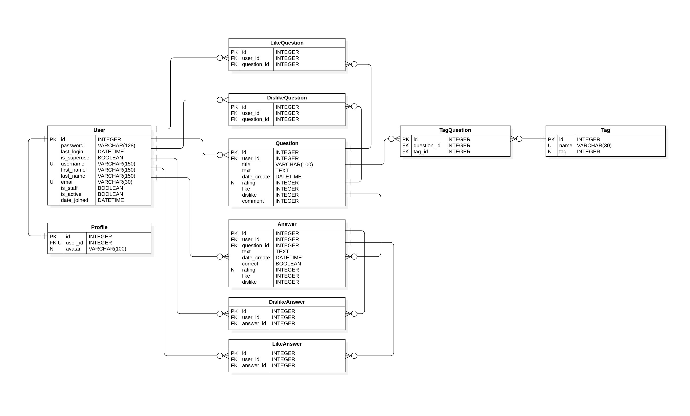

## Сайт вопросов и ответов "GainSkills"


## ER-диаграмма



На данный момент система построена так, что изменение рейтинга вопросов и ответов полностью ложится на плечи js (имеется
в виду посредственно).
Пользователь будет ставить лайк, на это событие будет вызываться обработчик js, который будет делать fetch-запрос на
определенный url бэкенда, и будут заноситься изменения в
таблицы LikeQuestion и Question (будет менять рейтинг в соответствии с весом параметра). Аналогично с другими
сущностями.
Кол-во лайков и прочего будет считаться с помощью Django ORM. В моделях Question, Answer определен
метод countRating, который считает rating объекта на основе полей (лайк, дизлайк, кол-во комментариев)

## Заполнение БД данными

Для этого воспользуемся сторонней библиотекой Faker, которая позволяет генерировать псевдослучайный и уникальные данные
из различных сфер жизни. Также напишем Management Command, который можно будет запустить с помощью команды:

`python manage.py filldb --ratio [число]` в квадратных скобках мы указываем коэффициент заполнения БД

Соответственно, после применения команды в базу должно быть добавлено:

+ пользователей — равное ratio;
+ вопросов — ratio * 10;
+ ответы — ratio * 100;
+ тэгов - ratio;
+ оценок пользователей - ratio * 200;


Чтобы уменьшить время выполнения скрипта, сперва создадим список объектов, а потом с помощью команды bulk_create() сразу
добавим все объекты в базу данных.

Время выполнения скрипта - 45 минут.


## Сравнение времени работы nginx, gunicorn и cache на nginx

### Задание

С помощью утилиты Apache Benchmark (ab, идет в комплекте с Apache, для Ubuntu пакет apache2-utils) или wrk сравните
производительность nginx (отдача статики) и gunicorn (запуск wsgi скриптов).

Необходимо провести пять измерений:

+ Отдача статического документа напрямую через nginx;
+ Отдача статического документа напрямую через gunicorn
+ Отдача динамического документа напрямую через gunicorn;
+ Отдача динамического документа через проксирование запроса с nginx на gunicorn;
+ Отдача динамического документа через проксирование запроса с nginx на gunicorn, при кэшировние ответа на nginx (proxy
  cache).

---
Сначала приведем конфигурационные файлы серверов.

#### Nginx 1.25.3

```nginx
events {}

http {

    upstream gainSkills {
        server localhost:8000;
    }

    server {
        listen 80;
        server_name localhost;
        include mime.types;

        gzip on;
        gzip_vary on;
        gzip_proxied any;
        gzip_comp_level 6;
        gzip_buffers 16 8k;
        gzip_http_version 1.1;
        gzip_types text/plain text/css application/json application/javascript text/xml application/xml application/xml+rss text/javascript;

        # указали ^~, чтобы показать, что у этого location приоритет выше регулярных выражений
        location ^~ /uploads/ {
            root /Users/ivanlobanov/Programming/Technopark/Semestr1/WebDev/Homework/gainSkills/main;
        }

        location ~ ^.+\.(css|svg|js|gif|png|jpg|jpeg|otf|woff)$ {
            root /Users/ivanlobanov/Programming/Technopark/Semestr1/WebDev/Homework/gainSkills/main;
        }

        location / {
            proxy_set_header Host $host;
            proxy_pass http://gainSkills;
        }
    }
}
```

#### Gunicorn 21.2.0

```python
raw_env = ['SECRET_KEY=django-insecure-g@@-sggo!g%6p39q$_p)oddz9#l!*d$ue46i-eoh@wdm#&=*b5']
accesslog = './var/tmp/gunicorn_logs/access.g.log'
port = 8000
workers = 2

bind = f'localhost:{port}'
wsgi_app = 'gainSkills.wsgi'

# Настройка сокета
# максимальное кол-во коннектов, ожидающих обработку запроса
backlog = 100

# максимальное кол-во обрабатываемых коннектов
worker_connections = 500

# максимальное кол-во запросов, которое обработает воркер перед перезагрузкой
max_requests = 50

# Время, которое воркер будет жить перед рестартом. Таймер обновляется, если пришел запрос на обработку
timeout = 60

```

Запустим <b>nginx</b> командой `nginx`, а <b>gunicorn</b> - `gunicorn -c gunicorn.conf.py`. <b>Nginx</b> запустится на
стандартном порте http, а <b>gunicorn</b> - на 8000.

<u>Будем создавать 5000 запросов.</u>

### Отдача статического документа напрямую через nginx

Команда `ab -n 5000 http://127.0.0.1/static/css/base.css`, результат:

```
Server Software:        nginx/1.25.3
Server Hostname:        127.0.0.1
Server Port:            80

Document Path:          /static/css/base.css
Document Length:        3459 bytes

Concurrency Level:      1
Time taken for tests:   0.599 seconds
Complete requests:      5000
Failed requests:        0
Total transferred:      18460000 bytes
HTML transferred:       17295000 bytes
Requests per second:    8353.17 [#/sec] (mean)
Time per request:       0.120 [ms] (mean)
Time per request:       0.120 [ms] (mean, across all concurrent requests)
Transfer rate:          30117.10 [Kbytes/sec] received

Connection Times (ms)
              min  mean[+/-sd] median   max
Connect:        0    0   0.0      0       0
Processing:     0    0   0.4      0      27
Waiting:        0    0   0.4      0      26
Total:          0    0   0.4      0      28

Percentage of the requests served within a certain time (ms)
  50%      0
  66%      0
  75%      0
  80%      0
  90%      0
  95%      0
  98%      0
  99%      0
 100%     28 (longest request)
```

### Отдача статического документа напрямую через gunicorn

<b>Gunicorn</b> по умолчанию не настроен на то, чтобы отдавать статику. Он работает в паре с <b>Nginx</b> и отдает
динамические документы. Мы можем в настройках проекта Django
поставить переменную окружения `DEBUG=True`, тогда WSGI-скрипт будет также выступать в роли веб-сервера и отдавать
статику. Стоит понимать, что если мы будем делать запрос на
localhost без указания порта, на котором запущены <b>Gunicorn</b> worker-процессы (т.е. 8000), то статику отдаст не <b>
Gunicorn</b>, а сам <b>Nginx</b>.

Команда `ab -n 5000 http://127.0.0.1:8000/static/css/base.css`, результат:

```
Server Software:        gunicorn
Server Hostname:        127.0.0.1
Server Port:            8000

Document Path:          /static/css/base.css
Document Length:        3459 bytes

Concurrency Level:      1
Time taken for tests:   17.163 seconds
Complete requests:      5000
Failed requests:        0
Total transferred:      19105000 bytes
HTML transferred:       17295000 bytes
Requests per second:    291.32 [#/sec] (mean)
Time per request:       3.433 [ms] (mean)
Time per request:       3.433 [ms] (mean, across all concurrent requests)
Transfer rate:          1087.05 [Kbytes/sec] received

Connection Times (ms)
              min  mean[+/-sd] median   max
Connect:        0    0   0.1      0       8
Processing:     1    3  18.9      1     432
Waiting:        0    3  18.9      1     430
Total:          1    3  19.0      1     432

Percentage of the requests served within a certain time (ms)
  50%      1
  66%      1
  75%      1
  80%      1
  90%      2
  95%      2
  98%     10
  99%    144
 100%    432 (longest request)
```

### Отдача динамического документа напрямую через gunicorn

Вернем переменную окружения `DEBUG=False` в прежнее состояние. Также для правильности измерения не забудем очистить кеш
в браузере. Будем делать запрос на страницу с вопросами,
она нам подходит.

Команда `ab -n 5000 http://127.0.0.1:8000/`, результат:

```
Server Software:        gunicorn
Server Hostname:        127.0.0.1
Server Port:            8000

Document Path:          /
Document Length:        74020 bytes

Concurrency Level:      1
Time taken for tests:   796.875 seconds
Complete requests:      5000
Failed requests:        0
Total transferred:      371585000 bytes
HTML transferred:       370100000 bytes
Requests per second:    6.27 [#/sec] (mean)
Time per request:       159.375 [ms] (mean)
Time per request:       159.375 [ms] (mean, across all concurrent requests)
Transfer rate:          455.37 [Kbytes/sec] received

Connection Times (ms)
              min  mean[+/-sd] median   max
Connect:        0    0   0.0      0       1
Processing:   115  159  15.1    159     476
Waiting:      114  157  14.9    156     474
Total:        115  159  15.1    159     476

Percentage of the requests served within a certain time (ms)
  50%    159
  66%    161
  75%    163
  80%    164
  90%    169
  95%    176
  98%    193
  99%    206
 100%    476 (longest request)
```

### Отдача динамического документа через проксирование запроса с nginx на gunicorn;

Пока что мы еще не настраивали кеширование динамических документов с помощью <b>nginx</b>.

Команда `ab -n 5000 http://127.0.0.1/`, результат:

```
Server Software:        nginx/1.25.3
Server Hostname:        127.0.0.1
Server Port:            80

Document Path:          /
Document Length:        74020 bytes

Concurrency Level:      1
Time taken for tests:   831.487 seconds
Complete requests:      5000
Failed requests:        0
Total transferred:      371605000 bytes
HTML transferred:       370100000 bytes
Requests per second:    6.01 [#/sec] (mean)
Time per request:       166.297 [ms] (mean)
Time per request:       166.297 [ms] (mean, across all concurrent requests)
Transfer rate:          436.44 [Kbytes/sec] received

Connection Times (ms)
              min  mean[+/-sd] median   max
Connect:        0    0   0.1      0       2
Processing:   115  166  22.4    163     525
Waiting:      115  166  22.4    163     525
Total:        115  166  22.4    163     525

Percentage of the requests served within a certain time (ms)
  50%    163
  66%    168
  75%    172
  80%    174
  90%    183
  95%    194
  98%    219
  99%    249
 100%    525 (longest request)
```

### Отдача динамического документа через проксирование запроса с nginx на gunicorn, при кэшировние ответа на nginx (proxy cache)

Сперва добавим изменения в конфигурации <b>nginx</b>:

```nginx
events {}

http {

    upstream gainSkills {
        server localhost:8000;
    }

    proxy_cache_path /Users/ivanlobanov/Programming/Technopark/Semestr1/WebDev/Homework/gainSkills/var/tmp/nginx/nginx_cache keys_zone=clientCache:10m max_size=50m inactive=24h;

    server {
        listen 80;
        server_name localhost;
        include mime.types;

        gzip on;
        gzip_vary on;
        gzip_proxied any;
        gzip_comp_level 6;
        gzip_buffers 16 8k;
        gzip_http_version 1.1;
        gzip_types text/plain text/css application/json application/javascript text/xml application/xml application/xml+rss text/javascript;

        proxy_cache clientCache;
        proxy_cache_valid 200 302 10m;
        proxy_cache_valid 404      1m;

        add_header Cache-Control "public, max-age=31536000";

        location ^~ /uploads/ {
            root /Users/ivanlobanov/Programming/Technopark/Semestr1/WebDev/Homework/gainSkills/main;
        }

        location ~ ^.+\.(css|svg|js|gif|png|jpg|jpeg|otf|woff)$ {
            root /Users/ivanlobanov/Programming/Technopark/Semestr1/WebDev/Homework/gainSkills/main;
        }

        location / {
            proxy_pass http://gainSkills;
            proxy_set_header Host $host;            
        }
    }

}
```

Теперь по пути `/Users/ivanlobanov/Programming/Technopark/Semestr1/WebDev/Homework/gainSkills/var/tmp/nginx/nginx_cache`
у нас будут создаваться бинарные файлы, содержащие кэш документов. Также не забудем почистить кэш в браузере перед
проведением эксперимента.

Команда `ab -n 5000 http://127.0.0.1/`, результат:

```
Server Software:        nginx/1.25.3
Server Hostname:        127.0.0.1
Server Port:            80

Document Path:          /
Document Length:        74020 bytes

Concurrency Level:      1
Time taken for tests:   1.048 seconds
Complete requests:      5000
Failed requests:        0
Total transferred:      371605000 bytes
HTML transferred:       370100000 bytes
Requests per second:    4769.27 [#/sec] (mean)
Time per request:       0.210 [ms] (mean)
Time per request:       0.210 [ms] (mean, across all concurrent requests)
Transfer rate:          346149.49 [Kbytes/sec] received

Connection Times (ms)
              min  mean[+/-sd] median   max
Connect:        0    0   0.0      0       0
Processing:     0    0   4.4      0     311
Waiting:        0    0   4.4      0     309
Total:          0    0   4.4      0     311

Percentage of the requests served within a certain time (ms)
  50%      0
  66%      0
  75%      0
  80%      0
  90%      0
  95%      0
  98%      0
  99%      0
 100%    311 (longest request)
```

## Ответы на вопросы

1. Насколько быстрее отдается статика по сравнению с WSGI?
   > Для ответа на вопрос, необходимо обратиться либо к параметру TPR (Time per request), либо к параметру RPS (Reqeust
   per second). Они обратно пропорционально зависят друг от друга. Для большей наглядности и правильности будем
   иследовать TPR.
   >
   > Nginx TPR: 0.120 [ms] (mean)
   >
   > Gunicorn TPR: 3.433 [ms] (mean)
   >
   > Разница на 3.313 [ms] (mean), nginx отдает статику быстрее в 28,6 раза в среднем.
2. Во сколько раз ускоряет работу proxy_cache?
   > Сравним время отдачи динамического документа через nginx без кеширования и с кешированием.
   >
   > Без кеширования: 166.297 [ms] (mean)
   >
   > С кешированием: 0.210 [ms] (mean)
   >
   > Таким образом, proxy_cache ускоряет работу в 792 раза.

Команда для запуска контейнера с Centrifugo:  
`docker run --ulimit nofile=262144:262144 -v $PWD/centrifugo:/centrifugo --name centrifugo -p 8001:8000 centrifugo/centrifugo:v5.1 centrifugo -c config.json`


